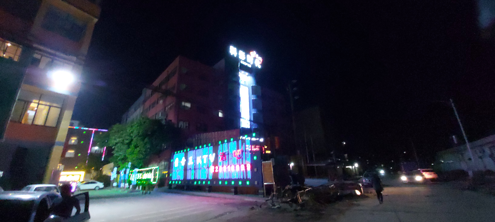

# 6月21日．Y18兵團出擊！ 大灣區．成本低．回報高！

## 經過幾個月不斷考察，莫生與 Y18團隊，又搵到倍升寶藏！

今次會到大家去一個大灣區重點科技發展的城市 — 廣州南沙慶盛市 ，將會是Y18兵團今年重點之一！

---

．發展潛力高 🚄
高鐵一個多小時到香港! 大量廣州人、長沙人搶佔，購買力強，人流眾多 ~~

高鐵一個多小時到香港

．投資額細 💰
只需投資¥10,000，就享有夾娃娃機創業一站式服務，迅速回本！

．產品多樣化
選擇無人販賣機， 多種貨品選擇， 0租金，低人力，低成本， 便可以享受零售收入和廣告收入！

---

今次莫生重點介紹大灣區科技城市-廣州南沙區慶盛市-科影時代商場，當然亦會觀覽周邊地帶，深入認識當地潛力。

link to site: http://y18.work/en/index.html

Explore this data story. . .

-圖-

-圖-

-圖-

-圖-

---

 - 出團 

 - 日期：6月21日（星期五）

 - 時間：11:30 am - 19:30 pm

 - 如有興趣出團，請帶備回鄉證出席！ 

## [立即留位出團 Whatsapp + 852 5333 1074 YT](https://api.whatsapp.com/send?phone=85253331074&text=我要去大灣區創業 )

